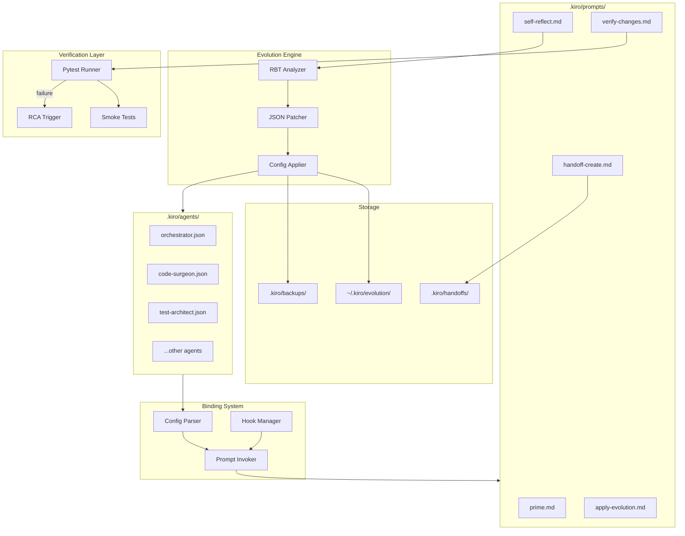

# Design Document: Agent-Prompt Integration & Self-Evolution System

## Overview

This design specifies a comprehensive system for binding agents to prompts, enabling automated verification through pytest, and creating a continuous self-improvement loop for the SEO Health Report platform.

The system consists of five core subsystems:
1. **Binding System** - Formal agent-prompt mappings with lifecycle hooks
2. **Evolution Engine** - Self-reflection, patch generation, and application
3. **Verification Layer** - Pytest integration for change validation
4. **Handoff Protocol** - Structured context transfer between agents
5. **Improvement Loop** - Orchestration of the complete feedback cycle

## Architecture



## Components and Interfaces

### 1. Agent Configuration Schema (Extended)

```json
{
  "name": "string",
  "description": "string",
  "prompt": "string",
  "model": "string",
  "version": "1.0.0",
  "tools": ["array"],
  "allowedTools": ["array"],
  "resources": ["array"],
  "toolsSettings": {},
  "prompts": {
    "onStart": ["prime"],
    "onComplete": ["self-reflect"],
    "available": ["code-review", "rca", "verify-changes"],
    "autoTrigger": {
      "afterWrite": ["verify-changes"],
      "afterError": ["rca"]
    }
  },
  "hooks": {
    "postToolUse": [
      {
        "matcher": "write",
        "command": "pytest tests/smoke/ -x --tb=line"
      }
    ]
  }
}
```

### 2. Binding System Interface

```python
from dataclasses import dataclass
from typing import List, Dict, Optional, Callable
from enum import Enum

class LifecycleEvent(Enum):
    SESSION_START = "onStart"
    TASK_COMPLETE = "onComplete"
    AFTER_WRITE = "afterWrite"
    AFTER_ERROR = "afterError"

@dataclass
class PromptBinding:
    event: LifecycleEvent
    prompt_names: List[str]
    condition: Optional[Callable[[], bool]] = None

@dataclass
class AgentPromptConfig:
    on_start: List[str]
    on_complete: List[str]
    available: List[str]
    auto_trigger: Dict[str, List[str]]

class BindingSystem:
    def parse_config(self, agent_config: dict) -> AgentPromptConfig:
        """Parse agent JSON config and extract prompt bindings."""
        pass
    
    def invoke_prompts(self, event: LifecycleEvent, agent_name: str) -> List[str]:
        """Invoke all prompts bound to the given lifecycle event."""
        pass
    
    def register_hook(self, matcher: str, command: str) -> None:
        """Register a post-tool-use hook for automatic verification."""
        pass
```

### 3. Evolution Engine Interface

```python
@dataclass
class RBTAnalysis:
    roses: List[str]      # What worked well
    buds: List[str]       # Opportunities for improvement
    thorns: List[str]     # What didn't work
    confidence: int       # 1-10 confidence score
    proposed_changes: Dict[str, any]  # JSON patch for agent config

@dataclass
class EvolutionRecord:
    timestamp: str
    agent_name: str
    change_type: str      # "prompt_update", "resource_add", "tool_setting"
    confidence_score: int
    changes_applied: Dict[str, any]
    verification_result: str  # "passed", "failed", "rolled_back"

class EvolutionEngine:
    def analyze_session(self, agent_name: str, session_log: str) -> RBTAnalysis:
        """Analyze agent session using RBT framework."""
        pass
    
    def generate_patch(self, analysis: RBTAnalysis) -> Optional[Dict]:
        """Generate JSON patch if confidence >= 8."""
        pass
    
    def apply_evolution(self, agent_name: str, patch: Dict) -> bool:
        """Apply patch to agent config with backup."""
        pass
    
    def rollback(self, agent_name: str) -> bool:
        """Restore agent config from backup."""
        pass
    
    def log_evolution(self, record: EvolutionRecord) -> None:
        """Log evolution to ~/.kiro/evolution/[agent]-evolution.md."""
        pass
```

### 4. Verification Layer Interface

```python
@dataclass
class TestResult:
    status: str           # "pass", "fail", "flaky"
    test_count: int
    failures: List[str]
    duration_seconds: float
    output: str

class VerificationLayer:
    def run_smoke_tests(self) -> TestResult:
        """Run pytest tests/smoke/ -x --tb=short."""
        pass
    
    def run_full_suite(self) -> TestResult:
        """Run pytest tests/ --tb=short."""
        pass
    
    def trigger_rca(self, failure_info: str) -> None:
        """Invoke @rca prompt for failure diagnosis."""
        pass
    
    def verify_evolution(self, agent_name: str, test_task: str) -> bool:
        """Run agent on test task and compare metrics."""
        pass
```

### 5. Handoff Protocol Interface

```python
@dataclass
class HandoffFile:
    timestamp: str
    source_agent: str
    target_agent: str
    task_description: str
    relevant_files: List[str]
    expected_output: str
    success_criteria: List[str]
    context_summary: str
    status: str           # "pending", "in_progress", "completed", "failed"
    results: Optional[str]

class HandoffProtocol:
    def create_handoff(self, source: str, target: str, task: str) -> str:
        """Create handoff file and return path."""
        pass
    
    def read_handoff(self, path: str) -> HandoffFile:
        """Read and parse handoff file."""
        pass
    
    def complete_handoff(self, path: str, results: str) -> None:
        """Write results and mark handoff complete."""
        pass
    
    def validate_handoff(self, handoff: HandoffFile) -> List[str]:
        """Validate handoff has all required fields."""
        pass
```

## Data Models

### Evolution Log Format (~/.kiro/evolution/[agent]-evolution.md)

```markdown
# Evolution Log: [agent-name]

## Evolution #1 - 2026-01-12T10:30:00Z

### RBT Analysis
**Roses (What Worked):**
- Successfully delegated to code-surgeon for review
- Context handoff was clean and complete

**Buds (Opportunities):**
- Could pre-load common file patterns
- Add caching for repeated file reads

**Thorns (Issues):**
- Lost context when switching between tasks
- Prompt invocation order was suboptimal

### Confidence Score: 8/10

### Proposed Changes
```json
{
  "resources": {
    "add": ["file://.kiro/specs/**/*.md"]
  },
  "toolsSettings.read.allowedPaths": {
    "add": ["./tests/**"]
  }
}
```

### Verification Result: PASSED
- Test task: "Review calculate_scores.py"
- Before: 45s completion, 2 context reloads
- After: 38s completion, 0 context reloads
- Improvement: 15.5%

---
```

### Handoff File Format (.kiro/handoffs/[timestamp]-[agent]-[task].md)

```markdown
# Handoff: code-surgeon - Review Score Calculator

## Metadata
- **Created**: 2026-01-12T10:30:00Z
- **Source Agent**: orchestrator
- **Target Agent**: code-surgeon
- **Status**: pending

## Task Description
Review the calculate_scores.py module for:
1. Security vulnerabilities
2. Performance issues
3. Code quality improvements

## Relevant Files
- seo-health-report/scripts/calculate_scores.py
- tests/unit/test_calculate_scores.py

## Expected Output
Structured review with findings categorized by severity.

## Success Criteria
- [ ] All security issues identified
- [ ] Performance bottlenecks flagged
- [ ] At least 3 actionable improvements suggested

## Context Summary
This module calculates composite SEO scores using weighted averages.
Recent changes added AI visibility scoring (35% weight).

## Results
<!-- Filled by target agent on completion -->
```

## Correctness Properties

*A property is a characteristic or behavior that should hold true across all valid executions of a system—essentially, a formal statement about what the system should do. Properties serve as the bridge between human-readable specifications and machine-verifiable correctness guarantees.*

### Property 1: Lifecycle Event Triggers

*For any* agent configuration with defined prompt bindings and *for any* lifecycle event (start, complete, write, error), the Binding System SHALL invoke exactly the prompts listed for that event in the correct order.

**Validates: Requirements 1.2, 1.3, 1.4, 1.5**

### Property 2: Config Parsing Completeness

*For any* valid agent configuration JSON, parsing SHALL extract all prompt bindings without data loss, and round-trip serialization SHALL produce an equivalent configuration.

**Validates: Requirements 1.1, 1.6**

### Property 3: Self-Reflection Output Schema

*For any* self-reflection analysis, the output SHALL contain all required fields (agent_name, confidence_score, roses, buds, thorns, proposed_changes) and confidence_score SHALL be an integer between 1 and 10.

**Validates: Requirements 2.1, 2.3**

### Property 4: High-Confidence Patch Generation

*For any* RBT analysis with confidence >= 8, the Evolution Engine SHALL generate a non-empty JSON patch targeting only allowed fields (prompt, resources, toolsSettings).

**Validates: Requirements 2.2, 2.4**

### Property 5: Evolution Application with Backup

*For any* evolution application, a backup SHALL be created before changes are applied, and if application fails, the original config SHALL be restored from backup.

**Validates: Requirements 3.2, 3.3, 3.5**

### Property 6: Regression Detection and Rollback

*For any* evolution verification where performance drops > 10%, the system SHALL rollback the evolution and log the rollback reason.

**Validates: Requirements 4.3, 4.4**

### Property 7: Test Verification Flow

*For any* code change verification, if smoke tests pass, the full test suite SHALL be executed, and if any tests fail, the RCA prompt SHALL be invoked.

**Validates: Requirements 5.2, 5.3, 5.5**

### Property 8: Handoff File Completeness

*For any* handoff file created by the Handoff Protocol, it SHALL contain all required sections (task_description, relevant_files, expected_output, success_criteria, context_summary) and follow the naming convention `[timestamp]-[agent]-[task].md`.

**Validates: Requirements 6.1, 6.2, 6.6**

### Property 9: Improvement Loop Ordering

*For any* improvement loop execution, the phases SHALL execute in strict order: prime → execute → verify → reflect → apply (if confidence >= 8) → verify-evolution → log.

**Validates: Requirements 7.1, 7.2**

### Property 10: Agent Config Schema Validation

*For any* agent configuration, it SHALL validate against the extended schema including version (semver), prompts (with all subfields), and hooks sections, with sensible defaults for missing optional fields.

**Validates: Requirements 9.1, 9.2, 9.3, 9.4, 9.5**

### Property 11: Evolution Log Completeness

*For any* evolution record logged, it SHALL contain timestamp, agent_name, change_type, confidence_score, changes_applied, and verification_result in human-readable markdown format.

**Validates: Requirements 10.1, 10.3, 10.5**

## Error Handling

### Binding System Errors

| Error | Handling | Recovery |
|-------|----------|----------|
| Prompt file not found | Log warning, continue execution | Skip missing prompt |
| Invalid prompt format | Log error with details | Skip malformed prompt |
| Circular prompt dependency | Detect and break cycle | Execute each prompt once |

### Evolution Engine Errors

| Error | Handling | Recovery |
|-------|----------|----------|
| Backup creation fails | Abort evolution | Log failure, no changes |
| Patch application fails | Restore from backup | Log failure reason |
| Config validation fails | Reject patch | Log validation errors |

### Verification Layer Errors

| Error | Handling | Recovery |
|-------|----------|----------|
| Pytest not found | Log error | Suggest installation |
| Test timeout | Kill process after 300s | Report partial results |
| Flaky test detected | Mark as flaky | Continue with warning |

### Handoff Protocol Errors

| Error | Handling | Recovery |
|-------|----------|----------|
| Handoff file not found | Log error | Return empty results |
| Invalid handoff format | Log validation errors | Reject handoff |
| Target agent unavailable | Retry 3 times | Mark handoff failed |

## Testing Strategy

### Unit Tests

Unit tests verify specific examples and edge cases:

- **Config parsing**: Test with minimal, full, and malformed configs
- **Prompt invocation**: Test each lifecycle event type
- **Patch generation**: Test confidence thresholds (7, 8, 9)
- **Backup/restore**: Test file operations and error cases
- **Handoff validation**: Test required field checks

### Property-Based Tests

Property tests verify universal properties across generated inputs:

- **Config round-trip**: Generate random configs, serialize/deserialize
- **Lifecycle triggers**: Generate event sequences, verify correct prompts
- **Schema validation**: Generate configs with various field combinations
- **Evolution logging**: Generate records, verify markdown format

### Smoke Tests (tests/smoke/)

Fast critical path tests (< 60 seconds total):

```python
@pytest.mark.smoke
def test_binding_system_loads_config():
    """Verify binding system can parse orchestrator config."""
    pass

@pytest.mark.smoke
def test_evolution_engine_creates_backup():
    """Verify backup is created before evolution."""
    pass

@pytest.mark.smoke
def test_verification_runs_pytest():
    """Verify pytest command is executed correctly."""
    pass

@pytest.mark.smoke
def test_handoff_creates_file():
    """Verify handoff file is created with correct format."""
    pass
```

### Integration Tests

End-to-end workflow tests:

- Full improvement loop execution
- Agent delegation with handoff
- Evolution application and verification
- Rollback on regression

### Test Configuration

```python
# pytest.ini additions
[pytest]
markers =
    smoke: Fast critical path tests (< 60s total)
    evolution: Evolution engine tests
    binding: Binding system tests
    handoff: Handoff protocol tests
```

### Property-Based Testing Framework

Use `hypothesis` for Python property-based testing:

```python
from hypothesis import given, strategies as st

@given(st.dictionaries(st.text(), st.text()))
def test_config_roundtrip(config_data):
    """Property 2: Config parsing completeness."""
    # Feature: agent-prompt-integration, Property 2
    pass
```
