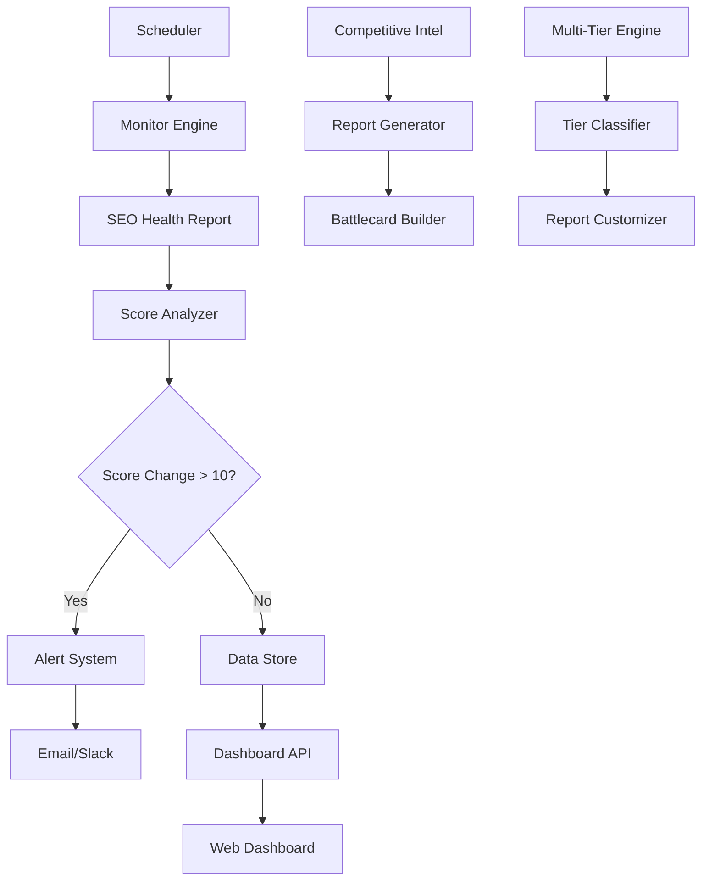

# Competitive OODA Loop - Design

## System Architecture



## Core Components

### 1. Monitor Engine (`competitive_monitor/`)
- **Purpose:** Continuous competitor SEO health tracking
- **Key Files:**
  - `monitor.py` - Main monitoring loop
  - `scheduler.py` - Cron-like task scheduling
  - `alerts.py` - Notification system
  - `storage.py` - Historical data management

### 2. Competitive Intelligence (`competitive-intel/`)
- **Purpose:** Automated competitive analysis and battlecards
- **Key Files:**
  - `analyzer.py` - Side-by-side comparison engine
  - `battlecards.py` - Sales talking points generator
  - `pricing_intel.py` - Market pricing analysis

### 3. Multi-Tier Reports (`multi-tier-reports/`)
- **Purpose:** Tiered reporting system for different price points
- **Key Files:**
  - `tier_classifier.py` - Automatic tier recommendation
  - `report_customizer.py` - Depth-based report generation
  - `pricing_optimizer.py` - Dynamic pricing suggestions

### 4. Dashboard (`dashboard/`)
- **Purpose:** Real-time competitive landscape visualization
- **Key Files:**
  - `api.py` - REST API for dashboard data
  - `components/` - React components for visualization

## Data Models

### Competitor Profile
```python
@dataclass
class CompetitorProfile:
    url: str
    company_name: str
    last_score: int
    current_score: int
    score_history: List[ScoreSnapshot]
    monitoring_frequency: int  # minutes
    alert_threshold: int  # score change
    created_at: datetime
    updated_at: datetime
```

### Score Snapshot
```python
@dataclass
class ScoreSnapshot:
    timestamp: datetime
    overall_score: int
    technical_score: int
    content_score: int
    ai_visibility_score: int
    grade: str
    key_changes: List[str]
```

### Alert Event
```python
@dataclass
class AlertEvent:
    competitor_url: str
    score_change: int
    previous_score: int
    current_score: int
    trigger_reason: str
    alert_channels: List[str]
    created_at: datetime
```

## API Contracts

### Monitor API
```python
# POST /api/competitors
{
    "url": "https://competitor.com",
    "company_name": "Competitor Inc",
    "monitoring_frequency": 60,  # minutes
    "alert_threshold": 10
}

# GET /api/competitors/{id}/history
{
    "competitor": CompetitorProfile,
    "history": List[ScoreSnapshot],
    "trends": {
        "direction": "up|down|stable",
        "velocity": float,
        "prediction": int
    }
}
```

### Intelligence API
```python
# POST /api/competitive-analysis
{
    "prospect_url": "https://prospect.com",
    "competitor_urls": ["https://comp1.com", "https://comp2.com"]
}

# Response
{
    "comparison_matrix": Dict[str, Any],
    "ai_visibility_gaps": List[str],
    "talking_points": List[str],
    "win_probability": float
}
```

### Multi-Tier API
```python
# POST /api/tier-recommendation
{
    "target_url": "https://client.com",
    "budget_range": "1000-5000"
}

# Response
{
    "recommended_tier": "Pro",
    "tier_features": List[str],
    "estimated_time": int,  # minutes
    "price_point": int,
    "upsell_opportunities": List[str]
}
```

## Integration Points

### Existing SEO Health Report System
- **Input:** Competitor URLs from monitoring system
- **Output:** Structured audit results for analysis
- **Frequency:** Every 1-6 hours based on monitoring settings

### Notification Systems
- **Email:** SMTP integration for score change alerts
- **Slack:** Webhook integration for team notifications
- **Dashboard:** Real-time WebSocket updates

### Data Storage
- **Primary:** SQLite for development, PostgreSQL for production
- **Cache:** Redis for frequently accessed competitor data
- **Files:** Local filesystem for generated reports and battlecards

## Security Considerations

### Data Protection
- Encrypt competitor URLs and company names at rest
- Hash sensitive identifiers in logs
- Implement data retention policies (90 days default)

### Access Control
- API key authentication for all endpoints
- Role-based access (Admin, Sales, Viewer)
- Audit logging for all competitive intelligence access

### Rate Limiting
- Respect robots.txt and crawl delays
- Implement exponential backoff for failed requests
- Cache results to minimize API calls

## Performance Requirements

### Monitoring Engine
- Process 50 competitors in <5 minutes
- Alert delivery within 1 hour of score change
- 99% uptime with graceful degradation

### Dashboard
- Load time <3 seconds for 30-day history
- Real-time updates via WebSocket
- Support 10 concurrent users

### Report Generation
- Basic tier: <5 minutes
- Pro tier: <10 minutes  
- Enterprise tier: <15 minutes

## Deployment Architecture

### Development
- Single server with SQLite
- Local file storage
- Email simulation (log to console)

### Production
- Load balancer + 2 app servers
- PostgreSQL with read replica
- Redis cluster for caching
- S3 for report storage
- CloudWatch for monitoring

## Error Handling Strategy

### Graceful Degradation
- Continue monitoring other competitors if one fails
- Partial reports when some audits fail
- Cached data when APIs are unavailable

### Retry Logic
- Exponential backoff for API failures
- Circuit breaker pattern for external services
- Dead letter queue for failed alerts

### Monitoring & Alerting
- Health checks every 5 minutes
- Error rate alerts >5%
- Performance degradation alerts >10s response time