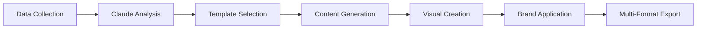
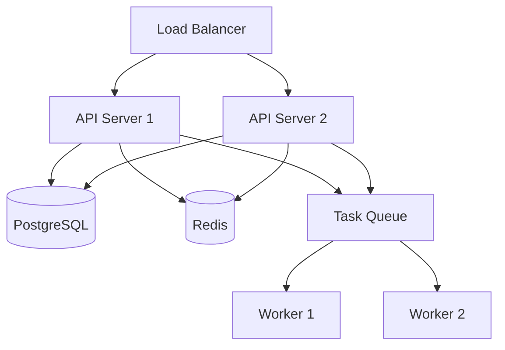

# Enterprise SEO AI Health Audit Platform - Design

## System Architecture Overview

The platform implements a 6-layer architecture designed to deliver 10X MORE VALUE than traditional $8K-$10K agency audits through continuous AI-powered intelligence.

```mermaid
graph TB
    subgraph "Layer 6: Executive Intelligence"
        EI[ROI Dashboards] --> EI2[Opportunity Scoring]
        EI2 --> EI3[Competitive Positioning]
        EI3 --> EI4[Resource Planning]
    end
    
    subgraph "Layer 5: AI Search Visibility"
        ASV[Answer Engine Tracking] --> ASV2[Citation Analysis]
        ASV2 --> ASV3[AEO Optimization]
        ASV3 --> ASV4[Schema Validation]
    end
    
    subgraph "Layer 4: Report Generation"
        RG[Daily Briefings] --> RG2[Weekly Analysis]
        RG2 --> RG3[Monthly Deep Dive]
        RG3 --> RG4[Custom Reports]
    end
    
    subgraph "Layer 3: Real-Time Monitoring"
        RTM[Keyword Tracking] --> RTM2[Traffic Alerts]
        RTM2 --> RTM3[Competitive Intelligence]
        RTM3 --> RTM4[Technical Monitoring]
    end
    
    subgraph "Layer 2: Intelligent Analysis"
        IA[Pattern Recognition] --> IA2[Predictive Modeling]
        IA2 --> IA3[Anomaly Detection]
        IA3 --> IA4[ROI Scoring]
    end
    
    subgraph "Layer 1: Data Ingestion"
        DI[Google APIs] --> DI2[SERP Tracking]
        DI2 --> DI3[Backlink Intelligence]
        DI3 --> DI4[AI Systems]
    end
    
    DI4 --> IA
    IA4 --> RTM
    RTM4 --> RG
    RG4 --> ASV
    ASV4 --> EI
```



## Layer 1: Data Ingestion Engine

### Core Data Sources
```python
@dataclass
class DataSource:
    name: str
    api_endpoint: str
    rate_limit: int
    priority: int
    fallback_sources: List[str]
```

### Google APIs Integration
- **Search Console API:** Actual search performance data
- **Analytics 4 API:** Traffic, conversion, user behavior
- **PageSpeed Insights API:** Core Web Vitals measurements
- **My Business API:** Local search data (if applicable)

### Third-Party Integrations
- **Ahrefs/SEMrush API:** Backlink intelligence, keyword data
- **Screaming Frog:** Technical crawl automation
- **SERP APIs:** Position tracking across 300+ keywords
- **Social APIs:** Brand mention tracking

### AI System Integrations
- **OpenAI API:** ChatGPT search visibility
- **Anthropic API:** Claude answer tracking
- **Perplexity API:** Citation monitoring
- **Google AIO:** AI Overview appearance

## Layer 2: Intelligent Analysis (Claude AI)

### Pattern Recognition Engine
```python
class PatternAnalyzer:
    def analyze_cannibalization(self, pages: List[Page]) -> List[Conflict]:
        """Detect pages competing for same keywords"""
        
    def detect_content_decay(self, historical_data: TimeSeriesData) -> List[DecayPattern]:
        """Identify gradual ranking decline patterns"""
        
    def find_link_anomalies(self, backlink_data: BacklinkProfile) -> List[Anomaly]:
        """Spot unnatural link patterns"""
```

### Predictive Modeling
- **Traffic Impact Projections:** Statistical models for ranking improvements
- **Revenue Forecasting:** Business impact of SEO changes
- **Competitive Response:** Likelihood of competitor reactions
- **Algorithm Resilience:** Vulnerability to future updates

### ROI Scoring Algorithm
```python
def calculate_roi_score(opportunity: Opportunity) -> ROIScore:
    business_impact = opportunity.traffic_potential * conversion_rate * avg_order_value
    implementation_effort = opportunity.difficulty * hourly_rate * estimated_hours
    success_probability = historical_success_rate * competitive_difficulty_factor
    
    return ROIScore(
        score=business_impact / implementation_effort * success_probability,
        confidence_interval=(low, high),
        timeline_estimate=estimated_hours / team_velocity
    )
```

## Layer 3: Real-Time Monitoring

### Keyword Position Tracking
- **Daily Updates:** 300+ keywords per site
- **SERP Feature Monitoring:** Featured snippets, knowledge panels
- **Competitor Movement:** Position changes across top 5 competitors
- **Volatility Detection:** Algorithm update impact assessment

### Alert System Architecture
```python
@dataclass
class Alert:
    trigger_type: AlertType
    severity: Severity
    affected_keywords: List[str]
    estimated_impact: ImpactScore
    recommended_actions: List[Action]
    delivery_channels: List[Channel]
```

### Competitive Intelligence Engine
- **Ranking Movement Detection:** Competitor gains/losses
- **Content Change Monitoring:** New pages, updates, removals
- **Backlink Acquisition Tracking:** New link sources
- **Technical Change Detection:** Site speed, mobile improvements

## Layer 4: Report Generation

### Automated Report Pipeline


### Report Types & Frequency
- **Daily Briefings:** 5-minute executive summaries
- **Weekly Intelligence:** Strategic analysis reports
- **Monthly Deep Dive:** Comprehensive 50-100 page reports
- **Quarterly Reviews:** Business impact and roadmap planning

### Custom Report Engine
```python
class ReportGenerator:
    def generate_executive_summary(self, data: AnalysisData) -> ExecutiveReport:
        """5-minute C-suite briefing"""
        
    def create_technical_audit(self, crawl_data: CrawlData) -> TechnicalReport:
        """Comprehensive technical analysis"""
        
    def build_competitive_analysis(self, competitor_data: CompetitorData) -> CompetitiveReport:
        """Market positioning intelligence"""
```

## Layer 5: AI Search Visibility (Differentiator)

### Answer Engine Optimization (AEO)
```python
class AEOAnalyzer:
    def assess_citation_likelihood(self, content: Content) -> CitationScore:
        """Probability of AI system citation"""
        
    def validate_schema_for_ai(self, page: Page) -> SchemaValidation:
        """AI-specific structured data validation"""
        
    def optimize_for_extraction(self, content: Content) -> OptimizationSuggestions:
        """Content structure for LLM consumption"""
```

### Multi-Platform Tracking
- **Google AI Overviews:** Keyword appearance tracking
- **ChatGPT Search:** Citation frequency monitoring
- **Perplexity:** Answer engine visibility
- **Claude Web Access:** Content reference tracking

### AEO Readiness Scoring
```python
def calculate_aeo_score(page: Page) -> AEOScore:
    factors = {
        'content_structure': analyze_heading_hierarchy(page),
        'answer_format': check_answer_paragraphs(page),
        'schema_markup': validate_faq_schema(page),
        'authority_signals': assess_eeat_signals(page),
        'citation_sources': count_reference_links(page)
    }
    
    return AEOScore(
        overall_score=weighted_average(factors),
        component_scores=factors,
        recommendations=generate_aeo_recommendations(factors)
    )
```

## Layer 6: Executive Intelligence

### ROI Dashboard Components
- **Revenue Attribution:** Organic search contribution to business goals
- **Opportunity Pipeline:** Ranked list of growth opportunities
- **Competitive Positioning:** Market share visualization
- **Resource Allocation:** Implementation timeline and costs

### Executive Briefing Format
```python
@dataclass
class ExecutiveBrief:
    date: datetime
    key_metrics: Dict[str, Metric]
    top_opportunities: List[Opportunity]
    competitive_threats: List[Threat]
    critical_alerts: List[Alert]
    recommended_actions: List[Action]
    roi_projections: ROIProjection
```

### Success Metrics Tracking
- **Traffic Growth:** Organic sessions, unique visitors
- **Revenue Impact:** Conversion attribution, pipeline influence
- **Competitive Position:** Visibility share, ranking distribution
- **Operational Efficiency:** Time to detect/respond to changes

## Data Models

### Core Entities
```python
@dataclass
class Site:
    url: str
    company_name: str
    industry: str
    primary_keywords: List[str]
    competitors: List[str]
    monitoring_config: MonitoringConfig

@dataclass
class HealthScore:
    overall: int  # 0-100
    technical: int
    content: int
    ai_visibility: int
    competitive_position: int
    trend: Trend

@dataclass
class Opportunity:
    title: str
    description: str
    category: OpportunityType
    business_impact: ImpactScore
    implementation_effort: EffortScore
    success_probability: float
    timeline_estimate: timedelta
```

## API Architecture

### RESTful Endpoints
```python
# Site Management
POST /api/sites
GET /api/sites/{site_id}
PUT /api/sites/{site_id}

# Health Monitoring
GET /api/sites/{site_id}/health
GET /api/sites/{site_id}/health/history

# Opportunities
GET /api/sites/{site_id}/opportunities
POST /api/sites/{site_id}/opportunities/{opp_id}/implement

# Reports
GET /api/sites/{site_id}/reports
POST /api/sites/{site_id}/reports/generate

# Competitive Intelligence
GET /api/sites/{site_id}/competitors
GET /api/sites/{site_id}/competitive-analysis
```

### WebSocket Events
```python
# Real-time updates
'ranking_change': RankingChangeEvent
'traffic_alert': TrafficAlertEvent
'competitor_move': CompetitorMoveEvent
'opportunity_discovered': OpportunityEvent
'health_score_update': HealthScoreEvent
```

## Security Architecture

### Authentication & Authorization
- **API Key Authentication:** Service-to-service communication
- **JWT Tokens:** User session management
- **Role-Based Access:** Admin, Manager, Viewer permissions
- **Multi-Tenant Isolation:** Data segregation by organization

### Data Protection
- **Encryption at Rest:** AES-256 for sensitive data
- **Encryption in Transit:** TLS 1.3 for all communications
- **PII Handling:** Anonymization of personal data
- **Audit Logging:** All access and modifications tracked

## Performance Requirements

### Response Time Targets
- **Dashboard Load:** <3 seconds for 90-day data
- **Report Generation:** <10 minutes for comprehensive reports
- **Alert Delivery:** <1 hour from trigger event
- **API Responses:** <500ms for standard queries

### Scalability Targets
- **Concurrent Sites:** 1,000+ without performance degradation
- **Data Processing:** 50 sites analyzed in <5 minutes
- **User Concurrency:** 100+ simultaneous dashboard users
- **Data Retention:** 2+ years historical data per site

## Deployment Architecture

### Production Environment


### Monitoring & Observability
- **Application Monitoring:** New Relic/DataDog
- **Log Aggregation:** ELK Stack
- **Error Tracking:** Sentry
- **Uptime Monitoring:** Pingdom/StatusPage
- **Performance Metrics:** Custom dashboards

## Integration Points

### Existing SEO Health Report System
- **Input:** Site URLs and configuration
- **Output:** Structured audit results
- **Enhancement:** Real-time monitoring layer
- **Migration:** Gradual transition from batch to streaming

### Third-Party Services
- **CRM Integration:** HubSpot, Salesforce
- **Communication:** Slack, Microsoft Teams
- **Analytics:** Google Analytics, Adobe Analytics
- **Business Intelligence:** Tableau, PowerBI