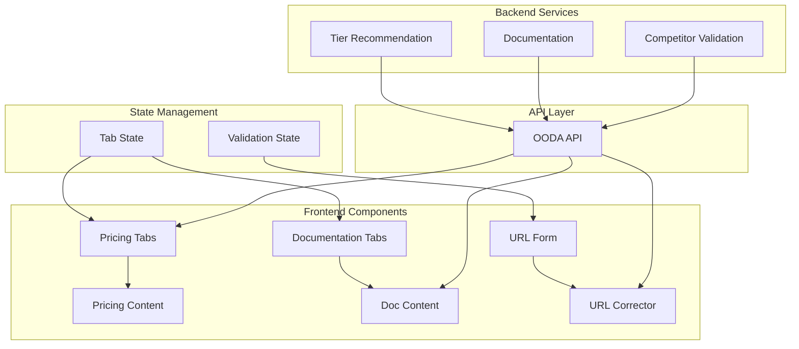

# Frontend Enhancement Design

## System Architecture



## Component Architecture

### 1. Pricing Tabs Component
```jsx
<PricingTabs>
  <TabNavigation>
    <Tab active={activeTab === 'basic'}>Basic</Tab>
    <Tab active={activeTab === 'pro'}>Pro</Tab>
    <Tab active={activeTab === 'enterprise'}>Enterprise</Tab>
  </TabNavigation>
  
  <TabContent>
    <PricingCard tier={activeTab} />
    <FeatureComparison tier={activeTab} />
    <CallToAction tier={activeTab} />
  </TabContent>
</PricingTabs>
```

### 2. Documentation Tabs Component
```jsx
<DocumentationTabs>
  <TabNavigation>
    <Tab active={activeTab === 'api'}>API Reference</Tab>
    <Tab active={activeTab === 'guides'}>Guides</Tab>
    <Tab active={activeTab === 'examples'}>Examples</Tab>
  </TabNavigation>
  
  <TabContent>
    <SearchBar />
    <DocumentationContent type={activeTab} />
    <CodeExamples />
  </TabContent>
</DocumentationTabs>
```

### 3. URL Auto-Correction Component
```jsx
<URLForm>
  <URLInput 
    value={url}
    onChange={handleURLChange}
    onBlur={handleURLCorrection}
  />
  <URLPreview correctedURL={correctedURL} />
  <ValidationMessage status={validationStatus} />
  <SubmitButton disabled={!isValid} />
</URLForm>
```

## Data Models

### Pricing Data Structure
```typescript
interface PricingTier {
  name: 'basic' | 'pro' | 'enterprise';
  price: {
    monthly: number;
    annual: number;
    setup?: number;
  };
  features: string[];
  limitations?: string[];
  popular?: boolean;
  callToAction: {
    text: string;
    action: string;
  };
}
```

### Documentation Structure
```typescript
interface DocumentationSection {
  id: string;
  title: string;
  type: 'api' | 'guide' | 'example';
  content: string;
  codeExamples?: CodeExample[];
  searchable: boolean;
}

interface CodeExample {
  language: string;
  code: string;
  description?: string;
}
```

### URL Validation
```typescript
interface URLValidation {
  original: string;
  corrected: string;
  isValid: boolean;
  corrections: string[];
  suggestions?: string[];
}
```

## API Endpoints

### Pricing API
```
GET /api/pricing/tiers
Response: {
  tiers: PricingTier[],
  comparison: FeatureComparison,
  recommendations: TierRecommendation[]
}
```

### Documentation API
```
GET /api/docs/{section}
Response: {
  content: DocumentationSection,
  navigation: NavigationItem[],
  searchIndex: SearchIndex
}
```

### URL Validation API
```
POST /api/validate-url
Request: { url: string }
Response: {
  validation: URLValidation,
  suggestions: string[]
}
```

## State Management

### Tab State
```typescript
interface TabState {
  activeTab: string;
  tabHistory: string[];
  loading: boolean;
  error?: string;
}

const useTabState = (defaultTab: string) => {
  const [state, setState] = useState<TabState>({
    activeTab: defaultTab,
    tabHistory: [defaultTab],
    loading: false
  });
  
  const switchTab = (tab: string) => {
    setState(prev => ({
      ...prev,
      activeTab: tab,
      tabHistory: [...prev.tabHistory, tab]
    }));
  };
  
  return { state, switchTab };
};
```

### URL Correction Logic
```typescript
const useURLCorrection = () => {
  const correctURL = (input: string): URLValidation => {
    let corrected = input.trim();
    const corrections: string[] = [];
    
    // Add protocol if missing
    if (!corrected.match(/^https?:\/\//)) {
      corrected = `https://${corrected}`;
      corrections.push('Added HTTPS protocol');
    }
    
    // Add www if domain looks incomplete
    if (corrected.match(/^https?:\/\/[^.]+\.[^.]+$/)) {
      corrected = corrected.replace(/^(https?:\/\/)/, '$1www.');
      corrections.push('Added www subdomain');
    }
    
    // Validate final URL
    const isValid = isValidURL(corrected);
    
    return {
      original: input,
      corrected,
      isValid,
      corrections
    };
  };
  
  return { correctURL };
};
```

## Styling & Animation

### Tab Transitions
```css
.tab-content {
  transition: opacity 0.3s ease-in-out;
  opacity: 1;
}

.tab-content.switching {
  opacity: 0;
}

.tab-navigation .tab {
  transition: all 0.2s ease;
  border-bottom: 2px solid transparent;
}

.tab-navigation .tab.active {
  border-bottom-color: #007bff;
  color: #007bff;
}
```

### URL Input Feedback
```css
.url-input {
  transition: border-color 0.2s ease;
}

.url-input.valid {
  border-color: #28a745;
}

.url-input.invalid {
  border-color: #dc3545;
}

.url-preview {
  background: #f8f9fa;
  padding: 0.5rem;
  border-radius: 0.25rem;
  font-family: monospace;
}
```

## Implementation Priority

### Phase 1: Core Functionality (Day 1)
1. Basic tab switching logic
2. URL auto-correction algorithm
3. API integration setup

### Phase 2: Enhanced UX (Day 2)
1. Smooth animations and transitions
2. Loading states and error handling
3. Responsive design implementation

### Phase 3: Advanced Features (Day 3)
1. Documentation search functionality
2. Interactive pricing calculator
3. Advanced URL validation and suggestions

## Integration Points

### Existing OODA System
- Leverage existing `/tier-recommendation/tiers` endpoint
- Integrate with competitor validation logic
- Use existing authentication system

### Frontend Framework
- Build as React components for reusability
- Use existing CSS framework/design system
- Integrate with current routing system
