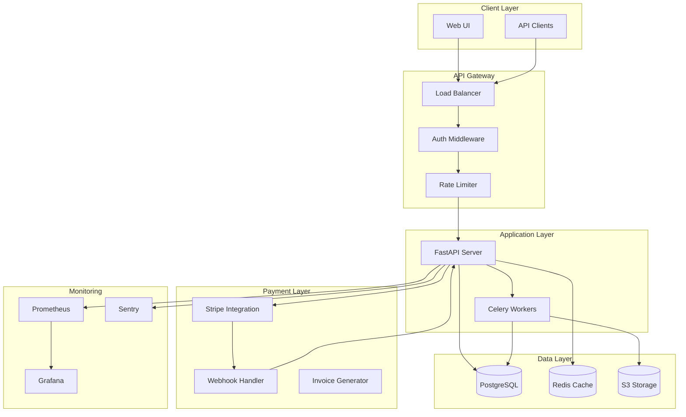

# Production Readiness & Payment Integration - Design

## System Architecture



## Component Design

### 1. Payment Integration

#### Stripe Checkout Flow
```python
# payment_service.py
from stripe import Checkout, Webhook
from typing import Literal

TierType = Literal["basic", "pro", "enterprise"]

TIER_PRICES = {
    "basic": {"monthly": 80000, "setup": 0},  # cents
    "pro": {"monthly": 250000, "setup": 50000},
    "enterprise": {"monthly": 600000, "setup": 200000}
}

class PaymentService:
    def create_checkout_session(
        self, 
        tier: TierType,
        customer_email: str,
        success_url: str,
        cancel_url: str
    ) -> str:
        """Create Stripe checkout session, return session URL"""
        
    def handle_webhook(self, payload: bytes, signature: str) -> dict:
        """Process Stripe webhook events"""
        
    def create_invoice(self, payment_intent_id: str) -> bytes:
        """Generate PDF invoice"""
```

#### Webhook Events
```python
# webhook_handlers.py
WEBHOOK_HANDLERS = {
    "checkout.session.completed": handle_checkout_complete,
    "payment_intent.succeeded": handle_payment_success,
    "payment_intent.payment_failed": handle_payment_failure,
    "invoice.payment_succeeded": handle_invoice_paid,
}

async def handle_checkout_complete(event: dict):
    """Queue audit job, send confirmation email"""
    
async def handle_payment_failure(event: dict):
    """Log failure, schedule retry, notify user"""
```

### 2. Production Infrastructure

#### Docker Compose (Development)
```yaml
# docker-compose.yml
version: '3.8'
services:
  api:
    build: .
    ports: ["8000:8000"]
    environment:
      - DATABASE_URL=postgresql://user:pass@db:5432/seo
      - REDIS_URL=redis://redis:6379
    depends_on: [db, redis]
    
  worker:
    build: .
    command: celery -A tasks worker
    depends_on: [db, redis]
    
  db:
    image: postgres:15
    volumes: ["pgdata:/var/lib/postgresql/data"]
    
  redis:
    image: redis:7-alpine
    
  prometheus:
    image: prom/prometheus
    volumes: ["./prometheus.yml:/etc/prometheus/prometheus.yml"]
    
  grafana:
    image: grafana/grafana
    ports: ["3000:3000"]
```

#### Kubernetes (Production)
```yaml
# k8s/api-deployment.yaml
apiVersion: apps/v1
kind: Deployment
metadata:
  name: seo-api
spec:
  replicas: 3
  selector:
    matchLabels:
      app: seo-api
  template:
    spec:
      containers:
      - name: api
        image: seo-health-report:latest
        resources:
          requests: {memory: "512Mi", cpu: "500m"}
          limits: {memory: "1Gi", cpu: "1000m"}
        livenessProbe:
          httpGet: {path: /health, port: 8000}
          initialDelaySeconds: 30
        readinessProbe:
          httpGet: {path: /ready, port: 8000}
```

### 3. Security Architecture

#### Authentication Flow
```python
# auth.py
from jose import jwt
from datetime import datetime, timedelta

SECRET_KEY = os.getenv("JWT_SECRET_KEY")
ALGORITHM = "HS256"
ACCESS_TOKEN_EXPIRE_HOURS = 24

def create_access_token(user_id: str, role: str) -> str:
    """Generate JWT token"""
    expire = datetime.utcnow() + timedelta(hours=ACCESS_TOKEN_EXPIRE_HOURS)
    return jwt.encode(
        {"sub": user_id, "role": role, "exp": expire},
        SECRET_KEY,
        algorithm=ALGORITHM
    )

def verify_token(token: str) -> dict:
    """Validate JWT and return payload"""
```

#### Rate Limiting
```python
# rate_limiter.py
from redis import Redis
from fastapi import HTTPException

redis = Redis.from_url(os.getenv("REDIS_URL"))

async def rate_limit(key: str, limit: int, window: int):
    """
    key: identifier (IP or user_id)
    limit: max requests
    window: time window in seconds
    """
    current = redis.incr(key)
    if current == 1:
        redis.expire(key, window)
    if current > limit:
        raise HTTPException(429, "Rate limit exceeded")
```

#### Input Validation
```python
# models.py
from pydantic import BaseModel, HttpUrl, validator

class AuditRequest(BaseModel):
    url: HttpUrl
    tier: Literal["basic", "pro", "enterprise"]
    company_name: str
    keywords: list[str] = []
    
    @validator("keywords")
    def validate_keywords(cls, v, values):
        tier = values.get("tier")
        max_keywords = {"basic": 100, "pro": 300, "enterprise": 1000}
        if len(v) > max_keywords[tier]:
            raise ValueError(f"Max {max_keywords[tier]} keywords for {tier}")
        return v
```

### 4. Performance Optimization

#### Caching Strategy
```python
# cache.py
from redis import Redis
import json

redis = Redis.from_url(os.getenv("REDIS_URL"))
CACHE_TTL = 86400  # 24 hours

def cache_audit_result(url: str, tier: str, result: dict):
    """Cache audit results"""
    key = f"audit:{url}:{tier}"
    redis.setex(key, CACHE_TTL, json.dumps(result))

def get_cached_audit(url: str, tier: str) -> dict | None:
    """Retrieve cached audit"""
    key = f"audit:{url}:{tier}"
    data = redis.get(key)
    return json.loads(data) if data else None
```

#### Async Processing
```python
# tasks.py
from celery import Celery

celery = Celery("tasks", broker=os.getenv("REDIS_URL"))

@celery.task(bind=True, max_retries=3)
def run_audit_task(self, audit_id: str, url: str, tier: str):
    """Background audit processing"""
    try:
        result = run_full_audit(url, tier)
        save_audit_result(audit_id, result)
        send_completion_email(audit_id)
    except Exception as exc:
        self.retry(exc=exc, countdown=60 * (2 ** self.request.retries))
```

### 5. Monitoring & Observability

#### Health Checks
```python
# health.py
from fastapi import APIRouter

router = APIRouter()

@router.get("/health")
async def health_check():
    """Basic liveness check"""
    return {"status": "healthy"}

@router.get("/ready")
async def readiness_check():
    """Check all dependencies"""
    checks = {
        "database": check_database(),
        "redis": check_redis(),
        "stripe": check_stripe_api(),
    }
    all_healthy = all(checks.values())
    return {
        "status": "ready" if all_healthy else "not_ready",
        "checks": checks
    }
```

#### Metrics Collection
```python
# metrics.py
from prometheus_client import Counter, Histogram, Gauge

audit_requests = Counter("audit_requests_total", "Total audit requests", ["tier"])
audit_duration = Histogram("audit_duration_seconds", "Audit processing time", ["tier"])
active_audits = Gauge("active_audits", "Currently running audits")
payment_success = Counter("payments_successful_total", "Successful payments", ["tier"])
payment_failures = Counter("payments_failed_total", "Failed payments", ["tier"])
```

#### Structured Logging
```python
# logging_config.py
import structlog

structlog.configure(
    processors=[
        structlog.processors.TimeStamper(fmt="iso"),
        structlog.processors.add_log_level,
        structlog.processors.JSONRenderer()
    ]
)

logger = structlog.get_logger()

# Usage
logger.info("audit_started", audit_id=audit_id, tier=tier, url=url)
logger.error("payment_failed", payment_id=payment_id, error=str(e))
```

### 6. Admin Dashboard

#### Dashboard API
```python
# admin_api.py
from fastapi import APIRouter, Depends

router = APIRouter(prefix="/admin", dependencies=[Depends(require_admin)])

@router.get("/metrics")
async def get_metrics():
    """Business metrics"""
    return {
        "mrr": calculate_mrr(),
        "active_subscriptions": count_active_subs(),
        "conversion_rate": calculate_conversion_rate(),
        "churn_rate": calculate_churn_rate(),
    }

@router.get("/system-health")
async def get_system_health():
    """Technical health metrics"""
    return {
        "uptime": get_uptime_percentage(),
        "error_rate": get_error_rate(),
        "avg_response_time": get_avg_response_time(),
        "active_workers": count_active_workers(),
    }
```

## Database Schema

```sql
-- users table
CREATE TABLE users (
    id UUID PRIMARY KEY DEFAULT gen_random_uuid(),
    email VARCHAR(255) UNIQUE NOT NULL,
    role VARCHAR(50) NOT NULL DEFAULT 'user',
    created_at TIMESTAMP DEFAULT NOW(),
    updated_at TIMESTAMP DEFAULT NOW()
);

-- subscriptions table
CREATE TABLE subscriptions (
    id UUID PRIMARY KEY DEFAULT gen_random_uuid(),
    user_id UUID REFERENCES users(id),
    tier VARCHAR(50) NOT NULL,
    stripe_subscription_id VARCHAR(255) UNIQUE,
    status VARCHAR(50) NOT NULL,
    current_period_start TIMESTAMP,
    current_period_end TIMESTAMP,
    created_at TIMESTAMP DEFAULT NOW()
);

-- audits table
CREATE TABLE audits (
    id UUID PRIMARY KEY DEFAULT gen_random_uuid(),
    user_id UUID REFERENCES users(id),
    url VARCHAR(500) NOT NULL,
    tier VARCHAR(50) NOT NULL,
    status VARCHAR(50) NOT NULL,
    result JSONB,
    report_url VARCHAR(500),
    created_at TIMESTAMP DEFAULT NOW(),
    completed_at TIMESTAMP
);

-- payments table
CREATE TABLE payments (
    id UUID PRIMARY KEY DEFAULT gen_random_uuid(),
    user_id UUID REFERENCES users(id),
    stripe_payment_intent_id VARCHAR(255) UNIQUE,
    amount INTEGER NOT NULL,
    currency VARCHAR(3) DEFAULT 'usd',
    status VARCHAR(50) NOT NULL,
    created_at TIMESTAMP DEFAULT NOW()
);

-- Create indexes
CREATE INDEX idx_audits_user_id ON audits(user_id);
CREATE INDEX idx_audits_status ON audits(status);
CREATE INDEX idx_subscriptions_user_id ON subscriptions(user_id);
CREATE INDEX idx_payments_user_id ON payments(user_id);
```

## API Endpoints

### Payment Endpoints
```
POST   /api/checkout/create          Create Stripe checkout session
POST   /api/webhooks/stripe          Handle Stripe webhooks
GET    /api/invoices/{payment_id}    Download invoice PDF
```

### Audit Endpoints
```
POST   /api/audits                   Create new audit (queues job)
GET    /api/audits/{id}              Get audit status/result
GET    /api/audits/{id}/report       Download report PDF
GET    /api/audits                   List user's audits
```

### Admin Endpoints
```
GET    /api/admin/metrics            Business metrics
GET    /api/admin/system-health      System health
GET    /api/admin/users              User management
POST   /api/admin/refunds            Process refund
```

### Health Endpoints
```
GET    /health                       Liveness check
GET    /ready                        Readiness check
GET    /metrics                      Prometheus metrics
```

## Deployment Strategy

### Phase 1: Staging Deployment
1. Deploy to staging environment
2. Run smoke tests
3. Load testing (100 concurrent users)
4. Security scan (OWASP ZAP)

### Phase 2: Production Deployment
1. Blue-green deployment
2. Database migrations (zero-downtime)
3. Gradual traffic shift (10% → 50% → 100%)
4. Rollback plan ready

### Phase 3: Post-Deployment
1. Monitor error rates (target: <0.1%)
2. Monitor performance (target: <500ms p95)
3. Monitor payment success rate (target: >98%)
4. Customer feedback collection

## Security Checklist

- [ ] HTTPS/TLS enforced
- [ ] JWT tokens with expiration
- [ ] Rate limiting per IP and user
- [ ] Input validation on all endpoints
- [ ] SQL injection prevention (parameterized queries)
- [ ] XSS prevention (output encoding)
- [ ] CSRF protection
- [ ] Secrets in environment variables (not code)
- [ ] Database backups encrypted
- [ ] Audit logging for sensitive operations
- [ ] PCI DSS compliance (via Stripe)
- [ ] GDPR compliance (data export/deletion)

## Performance Targets

| Metric | Target | Measurement |
|--------|--------|-------------|
| API Response (p95) | <500ms | Prometheus histogram |
| Audit Processing (Basic) | <5 min | Task duration tracking |
| Audit Processing (Pro) | <10 min | Task duration tracking |
| Audit Processing (Enterprise) | <15 min | Task duration tracking |
| Cache Hit Rate | >80% | Redis stats |
| Uptime | 99.9% | Uptime monitoring |
| Payment Success Rate | >98% | Stripe webhooks |

## Monitoring Alerts

### Critical Alerts (PagerDuty)
- API error rate >1%
- Database connection failures
- Payment processing failures
- System downtime

### Warning Alerts (Slack)
- API response time >1s
- Cache hit rate <70%
- Worker queue backlog >100
- Disk usage >80%

## Cost Estimation

### Infrastructure (Monthly)
- AWS EC2 (3x t3.medium): $150
- RDS PostgreSQL (db.t3.medium): $100
- ElastiCache Redis: $50
- S3 Storage (1TB): $25
- CloudFront CDN: $50
- **Total Infrastructure:** ~$375/month

### Services (Monthly)
- Stripe fees (2.9% + $0.30): Variable
- SendGrid (email): $15
- Sentry (error tracking): $26
- **Total Services:** ~$41/month + Stripe fees

### Total Operating Cost: ~$416/month + payment processing fees
